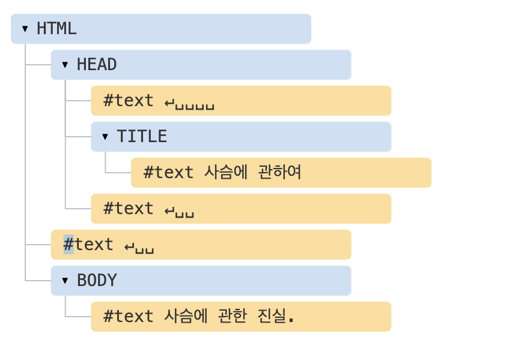

# Vanila JS DOM 조작 연습

## DOM

```html
<!DOCTYPE html>
<html>
  <head>
    <title>사슴에 관하여</title>
  </head>
  <body>
    사슴에 관한 진실.
  </body>
</html>
```



새 줄과 공백은 글자나 숫자처럼 항상 유효한 문자로 취급됩니다.  
따라서 이 두 특수문자는 텍스트 노드가 되고, DOM의 일부가 됩니다.

## DOM 찾기

> 텍스트 노드를 제외하려면, `Element` 를 꼭 붙혀줘야한다.  
> 텍스트 노드를 제외한 모든 자식 노드를 얻으려면 `DOM.children` 을 사용한다.

### 첫번째 자식의 노드(텍스트 노드 제외)

```js
baseElement.firstElementChild;
```

### 모든 자식 노드(텍스트 노드 제외)

```js
baseElement.children;
```

### 만능 선택자, querySelector, querySelectorAll.

```js
document.querySelector(css); // 자식 노드 중, css 선택자와 맞는 첫 노드
document.querySelectorAll(css); // 자식 노드 중, css 선택자와 맞는 모든 요소 컬렉션으로 반환
```

```js
elem.querySelector(css);
elem.querySelectorAll(css);
```

### 해당 CSS 선택자와 일치하는지 확인

```js
elem.matches(css); // css 선택자와 일치하면 True, 틀리면 False
```

### 특정 조건을 만족하는 부모 노드 찾기

```js
elem.closest(css); // 해당 css 선택자와 일치하는 가장 가까운 조상 요소 탐색, elem도 검색 대상에 포함된다.
```

### 후손, 자손 노드 확인하기

```js
elemA.contains(elemB); // elemB가 elemA에 속하거나, elemA == elemB 인 경우, True 반환
```
